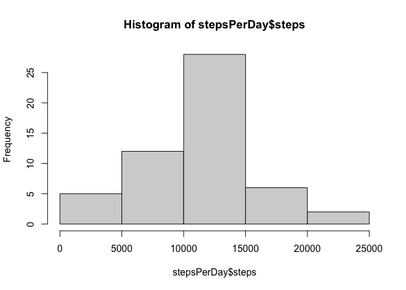
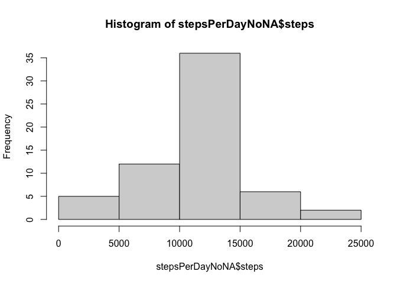
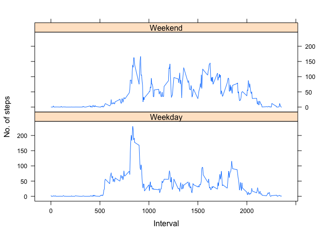

## Loading and preprocessing data

1. Code for reading in the dataset and/or processing the data

```r
activityData <- read.csv("activity.csv")
```

## What is mean total number of steps taken per day?

2. Histogram of the total number of steps taken each day


```r
stepsPerDay <- aggregate(steps ~ date, activityData, sum, na.rm = TRUE)
hist(stepsPerDay$steps)
```

<!-- -->

3. Mean and median number of steps taken each day

Mean of total steps per day

```r
MeanStepsPerDay <- mean(stepsPerDay$steps)
MeanStepsPerDay
```

```
## [1] 10766.19
```
Meadian of total steps per day

```r
MedianStepsPerDay <- median(stepsPerDay$steps)
MedianStepsPerDay
```

```
## [1] 10765
```

## What is the average daily activity pattern?

4. Time series plot of the average number of steps taken

```r
stepsPerInterval <- aggregate(steps ~ interval, activityData, mean, na.rm = TRUE)
plot(steps ~ interval, stepsPerInterval, type = "l")
```

<!-- -->

5. The 5-minute interval that, on average, contains the maximum number of steps

```r
maxStepsInterval <- stepsPerInterval[which.max(stepsPerInterval$steps),]$interval
maxStepsInterval
```

```
## [1] 835
```

## Imputing missing values
6. Code to describe and show a strategy for imputing missing data


```r
missingValues <- sum(is.na(activityData$steps))
missingValues
```

```
## [1] 2304
```

Function to imput missing values


```r
ImputMissingValue <- function(interval){
    stepsPerInterval[(stepsPerInterval$interval == interval),]$steps
}
```

Filling-in missing values


```r
activityDataNoNA <- activityData
for(i in 1:nrow(activityData)){
    if(is.na(activityData[i,]$steps)){
            activityDataNoNA[i,]$steps <- ImputMissingValue(activityDataNoNA[i,]$interval)
    }
}
```

7.Histogram of the total number of steps taken each day after missing values are imputed


```r
stepsPerDayNoNA <- aggregate(steps ~ date, activityDataNoNA, sum)
hist(stepsPerDayNoNA$steps)
```

<!-- -->


Mean and median with missing values filled in


```r
MeanStepsPerDayNoNA <- mean(stepsPerDayNoNA$steps)
MedianStepsPerDayNoNA <- median(stepsPerDayNoNA$steps)
MeanStepsPerDayNoNA
```

```
## [1] 10766.19
```

```r
MedianStepsPerDayNoNA
```

```
## [1] 10766.19
```

The mean didn’t change after the replacements of NAs, the median increased by about 0.1% of the original value.

## Are there differences in activity patterns between weekdays and weekends?

Create a new factor variable to differentiate between weekdays and weekends


```r
activityDataNoNA$date <-  as.Date(strptime(activityDataNoNA$date, format = "%Y-%m-%d"))
activityDataNoNA$day <- weekdays(activityDataNoNA$date)
for(i in 1:nrow(activityDataNoNA)){
    if(activityDataNoNA[i,]$day %in% c("Saturday", "Sunday")){
        activityDataNoNA[i,]$day <- "Weekend"
    }
    
    else{
        activityDataNoNA[i,]$day <- "Weekday"
    }
}
```

8.Panel plot comparing the average number of steps taken per 5-minute interval across weekdays and weekends


```r
stepsByDay <- aggregate(steps ~ interval + day, activityDataNoNA, mean)

library(lattice)
xyplot(steps ~ interval|day, stepsByDay, type = "l", xlab = "Interval", ylab = "No. of steps", layout = c(1,2))
```

<!-- -->

